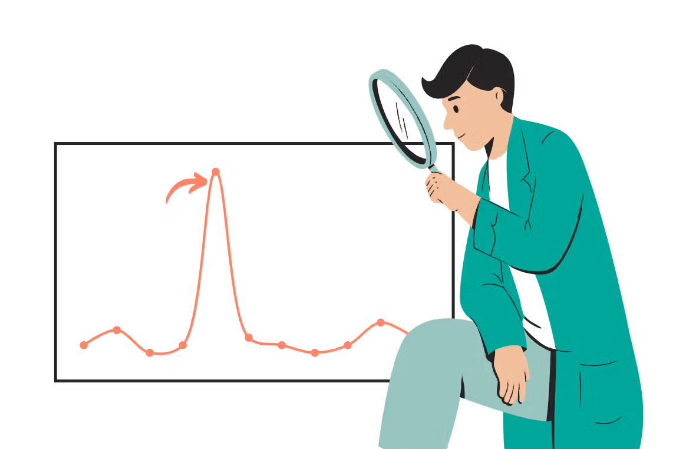
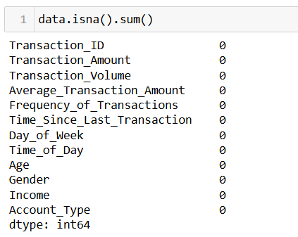
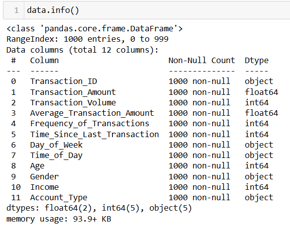
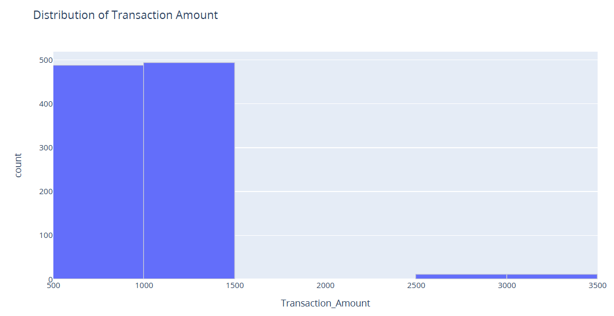
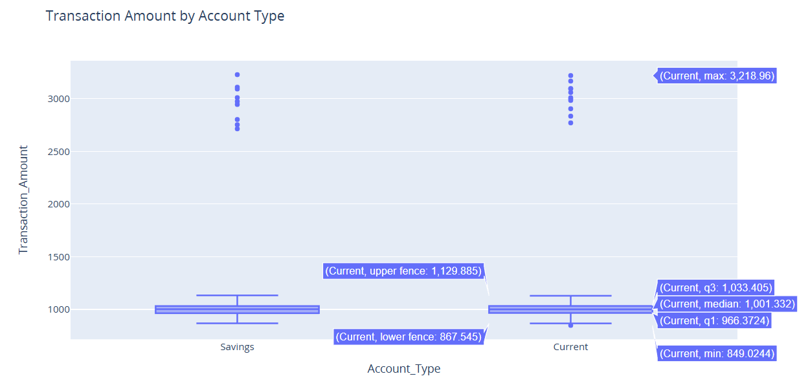

# Anomaly Detection in Transactions Using Python

Fraudlent behavior in online transaction has significanlty increased as people are switching more towards online payment. Anomaly detection in these transaction means identifying unususal patterns in these activities. These patterns deviate significantly from the expected norm and could indicate irregular or fraudlent behavior.
*Image Source: [Google Images](https://cdn.sanity.io/images/oaglaatp/production/295acf89823e7abc8af9e8d79a25ef6291a96169-1200x800.png?w=1200&h=800&auto=format)*

## Table of Contents

<ol>
<li><a href="#Overview"><b> Overview </a></b></li>
<li><a href="#Datasets"><b> Datasets </a></b></li>
<li><a href="#EDA"><b> Exploratory Data Analysis </a></b></li>
<li><a href="#featureengineering"><b> Feature Engineering </a></b></li>
<li><a href="#summary"><b> Summary Till Now </a></b></li>
<li><a href="#tuning"><b> Model Tuning </a></b></li>
<li><a href="#finalization"><b> Model Finalization </a></b></li>
<li><a href="#saveload"><b> Saving & Loading the Model </a></b></li>
<li><a href="#conclusion"><b> Conclusion </a></b></li>
</ol>

<h2 id="Overview">1. Overview</h2>
Anomaly detection is vital for businesses handling financial transactions, online activities, and security operations. The process involves collecting and preparing accurate transaction data, identifying patterns, and using specialized algorithms like isolation forest to detect anomalies.

<h2 id="Datasets">2. Dataset</h2>
The dataset has a total of:
1000 rows and 12 columns.

<h2 id="EDA">3. Exploratory Data Analysis</h2>

#### 3.1 Checking for the NULL values:

There are no any NULL values:

#### 3.2 Checking for information about the data:

All the data types seems correct, so we don't need to change anything here either.

#### 3.3 Visualizing the distribution of the Transaction Amount:

Looks like there is a huge difference based on the amount being transacted.

There are:
- 487 people who makes the transaction between 500 to 1000 Euros, 
- 493 people whose transaction ranges betweeen
1000 to 1500 Euros, 
- 10 people between 2500 to 3000 Euros, and
- 10 people between 3000 - 3500 Euros.

We have two types of accounts:
1. Current
2. Savings

#### 3.4 Visualizing the Transaction Amount by the account type:
