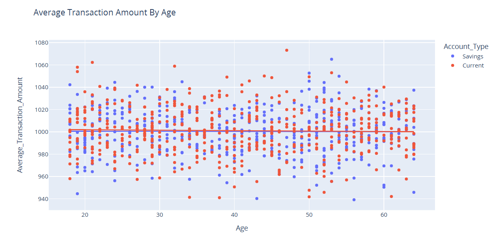
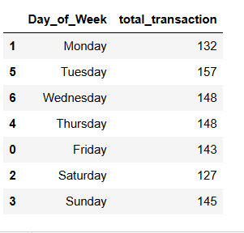
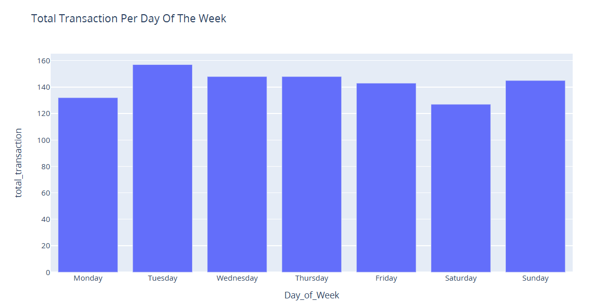
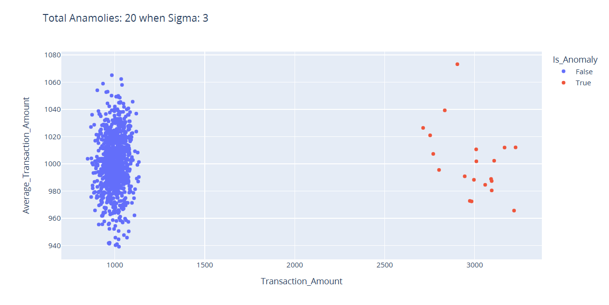
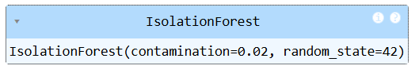

# Anomaly Detection in Transactions Using Python

Fraudlent behavior in online transaction has significanlty increased as people are switching more towards online payment. Anomaly detection in these transaction means identifying unususal patterns in these activities. These patterns deviate significantly from the expected norm and could indicate irregular or fraudlent behavior.
*Image Source: [Google Images](https://cdn.sanity.io/images/oaglaatp/production/295acf89823e7abc8af9e8d79a25ef6291a96169-1200x800.png?w=1200&h=800&auto=format)*

## Table of Contents

<ol>
<li><a href="#Overview"><b> Overview </a></b></li>
<li><a href="#Datasets"><b> Datasets </a></b></li>
<li><a href="#EDA"><b> Exploratory Data Analysis </a></b></li>
<li><a href="#BuildingModel"><b> Building Model </a></b></li>
<li><a href="#conclusion"><b> Conclusion </a></b></li>
</ol>

<h2 id="Overview">1. Overview</h2>
Anomaly detection is vital for businesses handling financial transactions, online activities, and security operations. The process involves collecting and preparing accurate transaction data, identifying patterns, and using specialized algorithms like isolation forest to detect anomalies.

<h2 id="Datasets">2. Dataset</h2>
The dataset has a total of:
1000 rows and 12 columns.

<h2 id="EDA">3. Exploratory Data Analysis</h2>

#### 3.1 Checking for the NULL values:

There are no any NULL values:

#### 3.2 Checking for information about the data:

All the data types seems correct, so we don't need to change anything here either.

#### 3.3 Visualizing the distribution of the Transaction Amount:

Looks like there is a huge difference based on the amount being transacted.

There are:
- 487 people who makes the transaction between 500 to 1000 Euros, 
- 493 people whose transaction ranges betweeen
1000 to 1500 Euros, 
- 10 people between 2500 to 3000 Euros, and
- 10 people between 3000 - 3500 Euros.

We have two types of accounts:
1. Current
2. Savings

#### 3.4 Visualizing the Transaction Amount by the account type:

#### 3.5 Visualizing the average transaction amount by age and the account type:

It seems like there is no any difference in the average transaction by age.

#### 3.6 Let's visualize the total number of transactions per day of the week:
First, we will group the data based on the days of the week and count them. 
The resulting table looks like below:

And when visualized, it looks like below, which doesn't show too much variance:

Since, its hard to detect the anomaly based on visual inspection, we will use the **Empirical Rule**
to define the anomaly.
For, this I have created a funciton, that will take the amount and classify whether its an anomaly or not
based on sigma_limit.

`sigma_limit` Function for Anomaly Detection:

This function detects anomalies in transaction amounts using the sigma limit method, based on the Empirical Rule (68-95-99.7 Rule). It identifies transactions that fall outside a defined threshold of standard deviations from the mean.

Functionality:
The function calculates the mean and standard deviation of the Transaction_Amount column in the dataset.
It then flags transactions as anomalies if the amount is greater than the mean plus sigma times the standard deviation or less than the mean minus sigma times the standard deviation.
Anomalous transactions are labeled with a new column Is_Anomaly (True for anomalies, False for normal transactions).
The function also generates a scatter plot, visually indicating anomalies, with the total count of flagged anomalies displayed in the title.
Here, we can pass the value of sigma as a parameter. 

So, the resulting graph would look like this when sigma=3:

Now, since we have defined a threshold, and have flagged the transaction as anomaly or not, we will use these data to build the machine learning model.

<h2 id="BuildingModel">4. Building The Model</h2>

Now, we will use that dataset where we have now column whether a transaction is 
an anomaly or not to train the Isolation Forest model.
So, for this out of all the columns, for independent features, we will 
use ` ['Transaction_Amount', 'Transaction_Volume',  'Average_Transaction_Amount', 'Frequency_of_Transactions']`
and 
`[Is_Anomaly]`as the target/dependent variable which we derived from the function we created.

Now,I will take these dependent and independent features and perform a 
`train_test_split` and then train the model as:

**NOTE:** Earlier, the sigma_limit function flagged 20 rows as anomaly out of 1000 rows, 
so that is the reason, we are setting contamination parameter as 2%  that would represent
the proportion of the dataset that we would expect to be anomalies.

`model = IsolationForest(contamination=0.02, random_state=42)`
`model.fit(X_train, y_train)`

